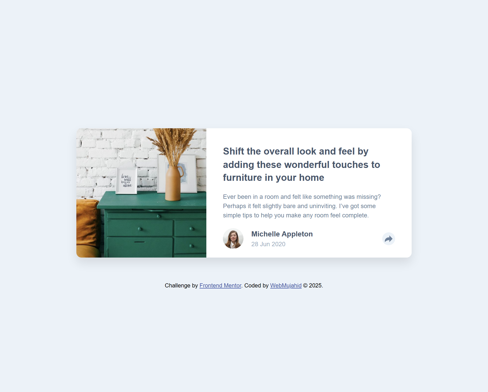
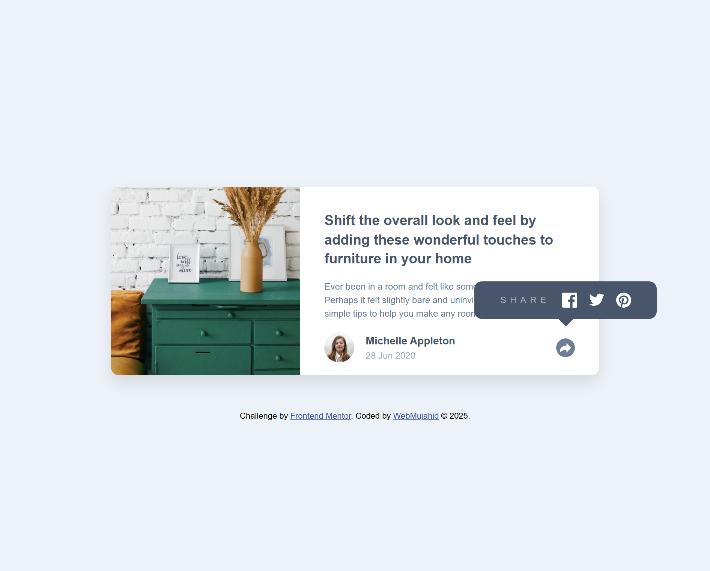
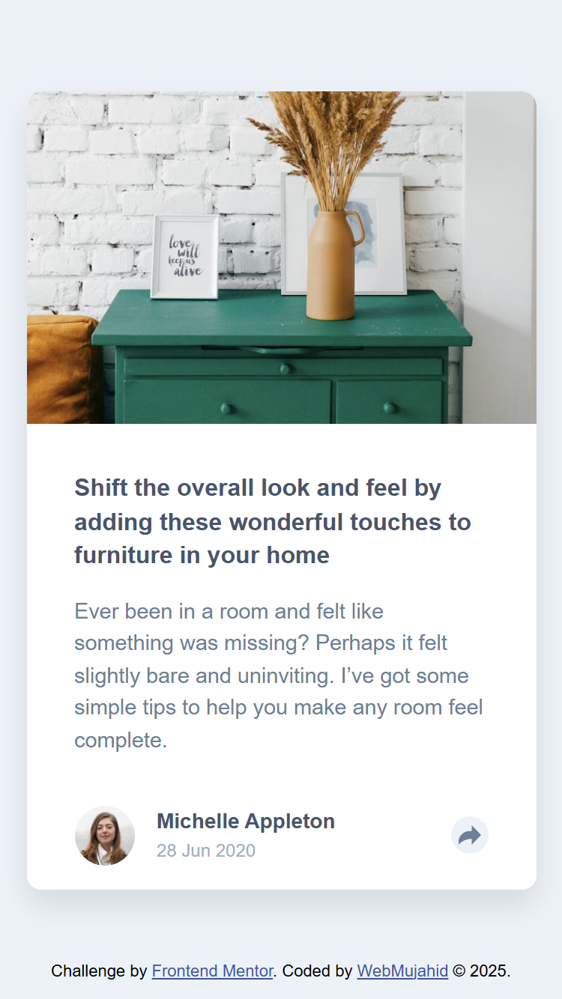
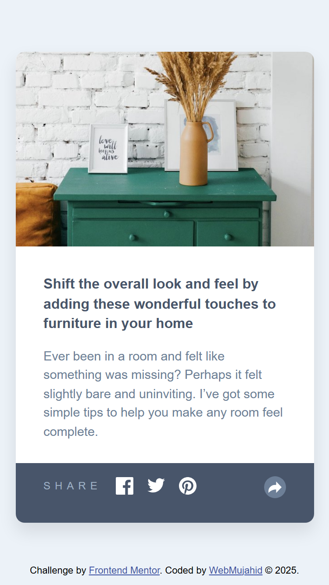

# Frontend Mentor - Article Preview Component



## Overview

### The Challenge

Your challenge was to build out this article preview component and get it looking as close to the design as possible. Users should be able to:

- View the optimal layout depending on their device's screen size
- Toggle the share icon tooltip
- See a share menu pop up when clicking the share button

### Screenshot


  



### Links

- Live Site URL: [Live Site Here](https://webmujahid-article-preview-component.netlify.app/)
- Solution URL: [Frontend Mentor Solution](https://www.frontendmentor.io/solutions/your-solution-link)

## My Process

### Built With

- Semantic HTML5 markup
- SCSS (compiled CSS)
- Flexbox
- CSS Media Queries
- JavaScript (Vanilla)

### What I Learned

While working on this project, I reinforced:

- Toggling classes dynamically using JavaScript
- Responsive design using SCSS with media queries
- Positioning elements with Flexbox and controlling visibility with conditional classes

Here’s a snippet of how I toggled the share icon using JavaScript:

```js
const shareBtn = document.getElementById("shareBtn");
const shareIcons = document.getElementById("shareIcons");

function toggleShare() {
  shareBtn.classList.toggle("active");
  shareIcons.classList.toggle("hidden");
}

shareBtn.addEventListener("click", toggleShare);

Continued Development
In future projects, I plan to:

1. Add transitions for smoother toggle animations

2. Improve accessibility (ARIA roles and keyboard navigation)

3. Convert SCSS to a CSS framework for quicker prototyping

Author
1. GitHub - Abdulgafar-Riro

2. Frontend Mentor - @Abdulgafar-Riro

Acknowledgments
Thanks to Frontend Mentor for this amazing challenge platform and the community for continuous inspiration!

© 2025 Coded by WebMujahid.
```
